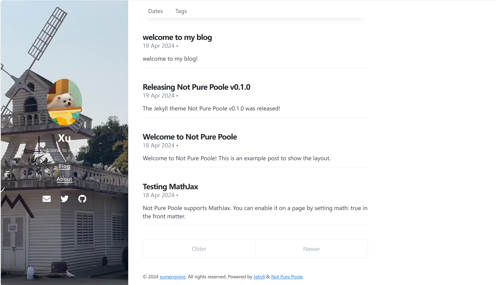
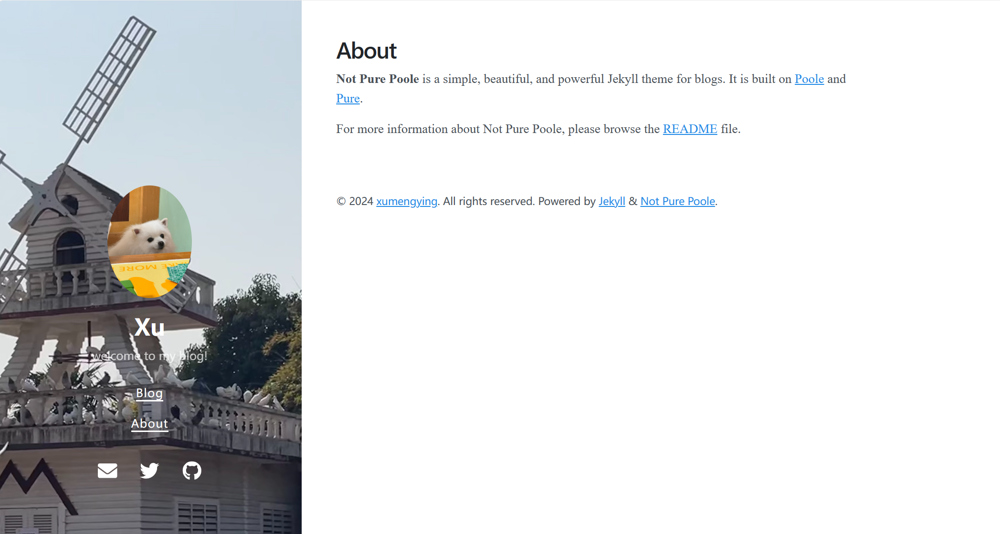
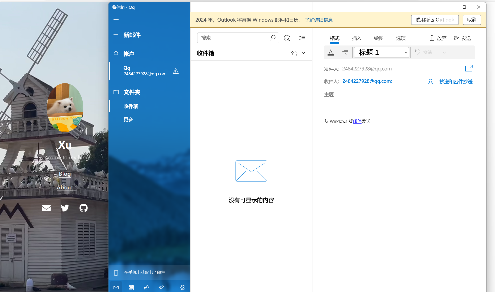
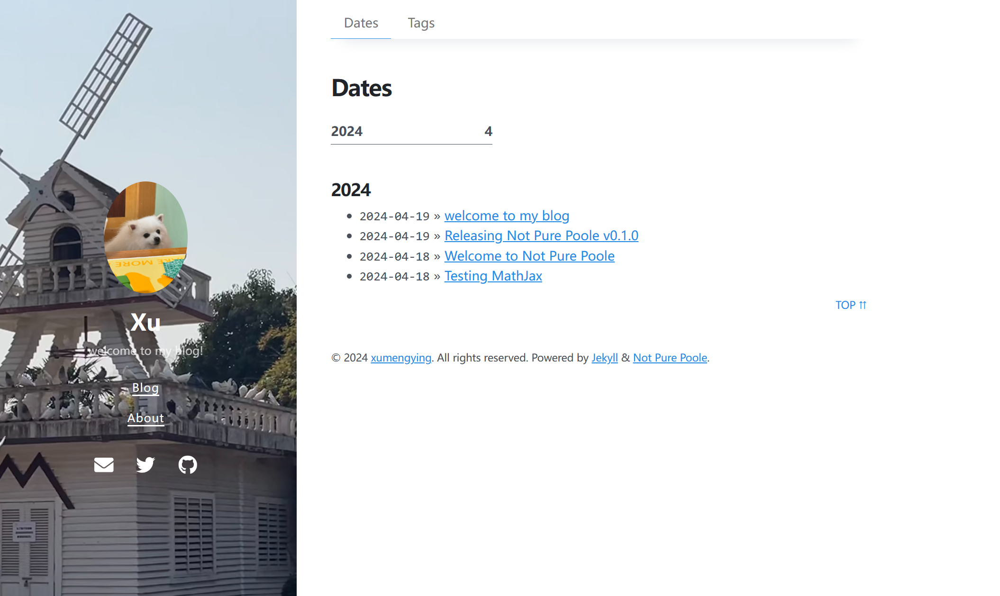
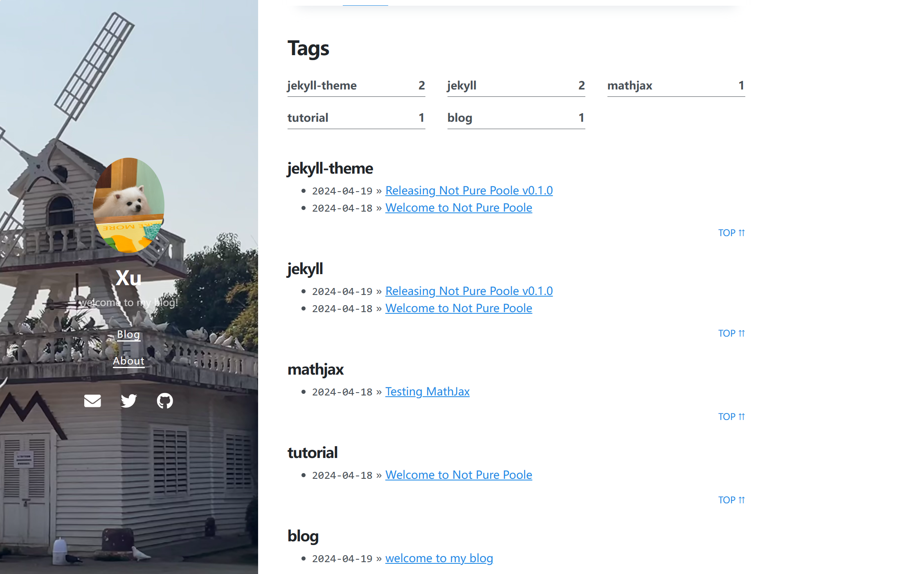

welcome to my blog!

此个人博客基于Jekyll搭建，选择了Not Pure Poole主题。Not Pure Poole 是一个简单、美观且强大的博客 Jekyll 主题，它建立在 Poole and Pure 之上。

Jekyll theme Not Pure Poole作者：vszhub

[参考链接](https://github.com/vszhub/not-pure-poole)

## 页面展示

主页


主页展示了作者的基本信息以及博客内容。
侧边栏展示了博客头像，昵称和简介，包含了blog和about两个功能，可以跳转到相应页面。
点击图标，可以访问相应的社交平台。

about


Email


主页顶端有dates和tags两个选项，均可以实现跳转。

dates


dates汇总了所有的博客，并按照时间进行了分类。

tags


tags展示了所有的标签，并按照标签对博客进行了分类，简洁明了。

## 准备阶段

1.安装Jekyll环境
1.1 安装git bash
1.2 安装Ruby
1.3 安装Jekyll
打开cmd，进入命令行界面，切换到Ruby的安装目录下，执行以下命令安装 bundler 和 jekyll

        ```yml
        $ gem install jekyll bundler
        ```

安装完成后，执行以下命令查看 jekyll 和 bundler 的版本，以确认是否安装成功

        ```yml
        $ jekyll -v
        $ bundler -v
        ```
[参考链接](https://zhuanlan.zhihu.com/p/672713591)
